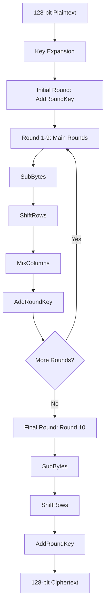
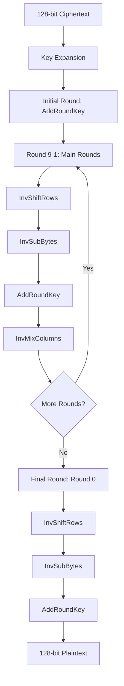

# AES-128 Encryption and Decryption Implementation

[](https://opensource.org/licenses/MIT)
[](https://github.com/Ardhish2210/AES128-EncryptionDecryption-Verilog/stargazers)
[](https://github.com/Ardhish2210/AES128-EncryptionDecryption-Verilog/network)

## 📋 Table of Contents
- [Overview](#overview)
- [Features](#features)
- [Algorithm Flow](#algorithm-flow)
- [File Structure](#file-structure)
- [Getting Started](#getting-started)
- [Usage](#usage)
- [Simulation Results](#simulation-results)
- [Technical Documentation](#technical-documentation)
- [Contributing](#contributing)
- [License](#license)

## 🔐 Overview

This repository contains a complete implementation of the Advanced Encryption Standard (AES) with 128-bit key length. AES-128 is a symmetric block cipher that encrypts data in 128-bit blocks using a 128-bit key through 10 rounds of cryptographic operations.

**Key Specifications:**
- **Block Size:** 128 bits (16 bytes)
- **Key Size:** 128 bits (16 bytes)
- **Rounds:** 10 rounds
- **Algorithm Type:** Symmetric Block Cipher

## ✨ Features

- ✅ Complete AES-128 encryption implementation
- ✅ Complete AES-128 decryption implementation
- ✅ Key expansion module
- ✅ All core AES operations (SubBytes, ShiftRows, MixColumns, AddRoundKey)
- ✅ Inverse operations for decryption
- ✅ Comprehensive test benches
- ✅ Detailed documentation

## 🔄 Algorithm Flow

### Encryption Process


### Decryption Process


## 📁 File Structure

```
AES128-EncryptionDecryption-Verilog/
├── AES128_Encryption/           # Encryption implementation
│   ├── aes_encryption.v         # Main encryption module
│   ├── key_expansion.v          # Key schedule implementation
│   ├── sub_bytes.v              # SubBytes transformation
│   ├── shift_rows.v             # ShiftRows transformation
│   ├── mix_columns.v            # MixColumns transformation
│   └── add_round_key.v          # AddRoundKey operation
├── AES128_Decryption/           # Decryption implementation
│   ├── aes_decryption.v         # Main decryption module
│   ├── inv_sub_bytes.v          # Inverse SubBytes
│   ├── inv_shift_rows.v         # Inverse ShiftRows
│   ├── inv_mix_columns.v        # Inverse MixColumns
│   └── inv_add_round_key.v      # Inverse AddRoundKey
├── nist.fips.197.pdf            # Official AES specification
├── README.md                    # This file
└── LICENSE                      # MIT License
```

## 🚀 Getting Started

### Prerequisites
- Verilog HDL simulator (ModelSim, Vivado, etc.)
- Basic understanding of cryptography and digital design

### Quick Start
1. Clone this repository:
   ```bash
   git clone https://github.com/Ardhish2210/AES128-EncryptionDecryption-Verilog.git
   cd AES128-EncryptionDecryption-Verilog
   ```

2. Navigate to the desired implementation:
   ```bash
   cd AES128_Encryption    # For encryption
   # or
   cd AES128_Decryption    # For decryption
   ```

3. Compile and simulate using your preferred simulator.

## 💡 Usage

### Encryption Example
```verilog
module test_encryption;
    reg [127:0] plaintext = 128'h48656c6c6f20576f726c64212121212121;
    reg [127:0] key = 128'h4d79536563726574000000000000000000;
    wire [127:0] ciphertext;
    
    aes_encryption uut (
        .plaintext(plaintext),
        .key(key),
        .ciphertext(ciphertext)
    );
endmodule
```

### Decryption Example
```verilog
module test_decryption;
    reg [127:0] ciphertext = 128'h... ; // Output from encryption
    reg [127:0] key = 128'h4d79536563726574000000000000000000;
    wire [127:0] plaintext;
    
    aes_decryption uut (
        .ciphertext(ciphertext),
        .key(key),
        .plaintext(plaintext)
    );
endmodule
```

## 📊 Simulation Results

### Encryption Waveform
*[Placeholder for encryption simulation waveform]*


### Decryption Waveform
*[Placeholder for decryption simulation waveform]*


### Test Vectors
The implementation has been verified against NIST test vectors to ensure correctness.

## 📖 Technical Documentation

For a comprehensive understanding of the AES-128 algorithm, including detailed explanations of each step, mathematical foundations, and implementation details, refer to the official NIST specification included in this repository: `nist.fips.197.pdf`

### Key Components

#### Core Operations
1. **SubBytes**: Non-linear byte substitution using S-Box
2. **ShiftRows**: Cyclic shift of state rows
3. **MixColumns**: Matrix multiplication in GF(2⁸)
4. **AddRoundKey**: XOR operation with round key

#### Key Schedule
The key expansion algorithm generates 11 round keys from the original 128-bit key:
- Round 0: Original key
- Rounds 1-10: Derived keys using rotation, substitution, and XOR operations

## 🤝 Contributing

Contributions are welcome! Please feel free to submit issues, feature requests, or pull requests.

### How to Contribute
1. Fork the repository
2. Create a feature branch (`git checkout -b feature/amazing-feature`)
3. Commit your changes (`git commit -m 'Add some amazing feature'`)
4. Push to the branch (`git push origin feature/amazing-feature`)
5. Open a Pull Request

### Guidelines
- Follow existing code style and conventions
- Add appropriate comments and documentation
- Test your changes thoroughly
- Update README if necessary

## 📝 License

This project is licensed under the MIT License - see the [LICENSE](LICENSE) file for details.

```
MIT License

Copyright (c) 2024 Ardhish2210

Permission is hereby granted, free of charge, to any person obtaining a copy
of this software and associated documentation files (the "Software"), to deal
in the Software without restriction, including without limitation the rights
to use, copy, modify, merge, publish, distribute, sublicense, and/or sell
copies of the Software, and to permit persons to whom the Software is
furnished to do so, subject to the following conditions:

The above copyright notice and this permission notice shall be included in all
copies or substantial portions of the Software.

THE SOFTWARE IS PROVIDED "AS IS", WITHOUT WARRANTY OF ANY KIND, EXPRESS OR
IMPLIED, INCLUDING BUT NOT LIMITED TO THE WARRANTIES OF MERCHANTABILITY,
FITNESS FOR A PARTICULAR PURPOSE AND NONINFRINGEMENT. IN NO EVENT SHALL THE
AUTHORS OR COPYRIGHT HOLDERS BE LIABLE FOR ANY CLAIM, DAMAGES OR OTHER
LIABILITY, WHETHER IN AN ACTION OF CONTRACT, TORT OR OTHERWISE, ARISING FROM,
OUT OF OR IN CONNECTION WITH THE SOFTWARE OR THE USE OR OTHER DEALINGS IN THE
SOFTWARE.
```

## 🔗 References

- [NIST FIPS 197 - Advanced Encryption Standard](https://csrc.nist.gov/publications/detail/fips/197/final)
- [AES Algorithm Overview](https://en.wikipedia.org/wiki/Advanced_Encryption_Standard)

---

⭐ If you found this project helpful, please consider giving it a star!

**Author:** [@Ardhish2210](https://github.com/Ardhish2210)  
**Last Updated:** July 2025
