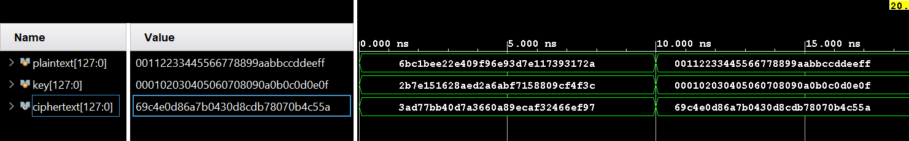
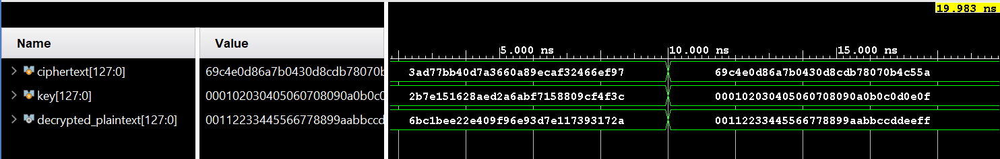

# 🔐 AES-128 Encryption & Decryption Implementation

<div align="center">

[](https://opensource.org/licenses/MIT)
[](https://github.com/Ardhish2210/AES128-EncryptionDecryption-Verilog/stargazers)
[](https://github.com/Ardhish2210/AES128-EncryptionDecryption-Verilog/network)
[](https://www.verilog.com/)
[](https://en.wikipedia.org/wiki/Advanced_Encryption_Standard)

</div>

## 🎯 Table of Contents

<div align="center">

| 🔍 **Section** | 📝 **Description** |
|:-------------:|:-------------------|
| [🔐 Overview](#-overview) | Understanding AES-128 Implementation |
| [✨ Features](#-features) | What's Included in This Repo |
| [🔄 Algorithm Flow](#-algorithm-flow) | Visual Encryption/Decryption Process |
| [📁 File Structure](#-file-structure) | Project Organization |
| [🚀 Getting Started](#-getting-started) | Quick Setup Guide |
| [💡 Usage](#-usage) | Code Examples & Implementation |
| [📊 Simulation Results](#-simulation-results) | Waveform Analysis |
| [🧪 Testing](#-testing) | Test Bench Information |
| [📖 Technical Documentation](#-technical-documentation) | Deep Dive into AES |
| [🤝 Contributing](#-contributing) | Join the Development |
| [📝 License](#-license) | Legal Information |

</div>

## 🔐 Overview

This repository contains a complete implementation of the Advanced Encryption Standard (AES) with 128-bit key length in Verilog HDL. AES-128 is a symmetric block cipher that encrypts data in 128-bit blocks using a 128-bit key through 10 rounds of cryptographic operations.

**Key Specifications:**
- 🔢 **Block Size:** 128 bits (16 bytes)
- 🔑 **Key Size:** 128 bits (16 bytes)
- 🔄 **Rounds:** 10 rounds
- ⚙️ **Algorithm Type:** Symmetric Block Cipher
- 🛠️ **Implementation:** Verilog HDL

## ✨ Features

- ✅ **Complete AES-128 Encryption**: Full encryption pipeline with all 10 rounds
- ✅ **Complete AES-128 Decryption**: Full decryption pipeline with inverse operations
- ✅ **Modular Design**: Separate modules for each AES operation
- ✅ **Key Expansion**: Dedicated key schedule implementation
- ✅ **Core AES Operations**: SubBytes, ShiftRows, MixColumns, AddRoundKey
- ✅ **Inverse Operations**: All inverse transformations for decryption
- ✅ **Comprehensive Test Benches**: Separate test benches for encryption and decryption
- ✅ **Waveform Analysis**: Visual simulation results
- ✅ **NIST Compliant**: Follows official AES specification
- ✅ **Well Documented**: Clear code structure and comments

## 🔄 Algorithm Flow

### 🔐 Encryption Process

```mermaid
flowchart LR
    A["🔤 128-bit<br/>Plaintext"] --> B["🔑 Key<br/>Expansion"]
    B --> C["⚡ Initial Round<br/>AddRoundKey"]
    C --> D["🔄 Rounds 1-9"]
    D --> E["🔄 SubBytes"]
    E --> F["↩️ ShiftRows"]
    F --> G["🧮 MixColumns"]
    G --> H["🔑 AddRoundKey"]
    H --> I{"🔄 More<br/>Rounds?"}
    I -->|"✅ Yes"| D
    I -->|"❌ No"| J["🏁 Final Round 10"]
    J --> K["🔄 SubBytes"]
    K --> L["↩️ ShiftRows"]
    L --> M["🔑 AddRoundKey"]
    M --> N["🔒 128-bit<br/>Ciphertext"]
    
    style A fill:#e1f5fe,stroke:#01579b,stroke-width:3px
    style N fill:#f3e5f5,stroke:#4a148c,stroke-width:3px
    style B fill:#fff3e0,stroke:#e65100,stroke-width:2px
    style D fill:#e8f5e8,stroke:#2e7d32,stroke-width:2px
    style J fill:#fff8e1,stroke:#f57f17,stroke-width:2px
    style I fill:#fce4ec,stroke:#c2185b,stroke-width:2px
```


### 🔓 Decryption Process

```mermaid
flowchart LR
    A["🔒 128-bit<br/>Ciphertext"] --> B["🔑 Key<br/>Expansion"]
    B --> C["⚡ Initial Round<br/>AddRoundKey"]
    C --> D["🔄 Rounds 9-1"]
    D --> E["↪️ InvShiftRows"]
    E --> F["🔄 InvSubBytes"]
    F --> G["🔑 AddRoundKey"]
    G --> H["🧮 InvMixColumns"]
    H --> I{"🔄 More<br/>Rounds?"}
    I -->|"✅ Yes"| D
    I -->|"❌ No"| J["🏁 Final Round 0"]
    J --> K["↪️ InvShiftRows"]
    K --> L["🔄 InvSubBytes"]
    L --> M["🔑 AddRoundKey"]
    M --> N["🔤 128-bit<br/>Plaintext"]
    
    style A fill:#f3e5f5,stroke:#4a148c,stroke-width:3px
    style N fill:#e1f5fe,stroke:#01579b,stroke-width:3px
    style B fill:#fff3e0,stroke:#e65100,stroke-width:2px
    style D fill:#ffebee,stroke:#c62828,stroke-width:2px
    style J fill:#fff8e1,stroke:#f57f17,stroke-width:2px
    style I fill:#fce4ec,stroke:#c2185b,stroke-width:2px
```


## 📁 File Structure

### 📂 Project Organization
```
AES128-EncryptionDecryption-Verilog/
├── 📁 AES128_Encryption/           # 🔐 Encryption Implementation
│   ├── 🔧 AES128_encryption.v      # Main encryption module
│   ├── 🔧 AES128_encryption_tb.v   # Encryption test bench
│   ├── 🔧 add_round_key.v          # AddRoundKey operation
│   ├── 🔧 aes_sbox.v               # AES S-Box implementation
│   ├── 🔧 encrypt_round.v          # Single encryption round
│   ├── 🔧 key_expansion.v          # Key schedule generation
│   ├── 🔧 mix_columns.v            # MixColumns transformation
│   ├── 🔧 shift_rows.v             # ShiftRows transformation
│   ├── 🔧 sub_bytes.v              # SubBytes transformation
│   ├── 🔧 sub_words.v              # SubWord operation for key expansion
│   └── 📈 AES_encryption_waveform.png # Encryption simulation results
├── 📁 AES128_Decryption/           # 🔓 Decryption Implementation
│   ├── 🔧 AES128_decryption.v      # Main decryption module
│   ├── 🔧 AES128_decryption_tb.v   # Decryption test bench
│   ├── 🔧 add_round_key.v          # AddRoundKey operation
│   ├── 🔧 decrypt_round.v          # Single decryption round
│   ├── 🔧 inverse_MixColumns.v     # Inverse MixColumns transformation
│   ├── 🔧 inverse_ShiftRows.v      # Inverse ShiftRows transformation
│   ├── 🔧 inverse_SubBytes.v       # Inverse SubBytes transformation
│   ├── 🔧 inverse_sbox.v           # Inverse S-Box implementation
│   ├── 🔧 key_expansion.v          # Key schedule generation
│   └── 📈 AES_decryption_waveform.png # Decryption simulation results
├── 📖 nist.fips.197.pdf            # Official AES specification
├── 📝 README.md                    # This comprehensive guide
└── 📄 LICENSE                      # MIT License
```

### 🎯 Module Breakdown

#### 🔐 Encryption Modules
| Module | Purpose | Location |
|--------|---------|----------|
| `AES128_encryption.v` | 🎯 Top-level encryption controller | `AES128_Encryption/` |
| `encrypt_round.v` | 🔄 Single round encryption logic | `AES128_Encryption/` |
| `key_expansion.v` | 🔑 128-bit key expansion to 11 round keys | `AES128_Encryption/` |
| `sub_bytes.v` | 🔄 SubBytes transformation using S-Box | `AES128_Encryption/` |
| `shift_rows.v` | ↩️ ShiftRows transformation | `AES128_Encryption/` |
| `mix_columns.v` | 🧮 MixColumns transformation | `AES128_Encryption/` |
| `add_round_key.v` | 🔑 AddRoundKey XOR operation | `AES128_Encryption/` |
| `aes_sbox.v` | 📊 AES S-Box lookup table | `AES128_Encryption/` |
| `sub_words.v` | 🔄 SubWord operation for key schedule | `AES128_Encryption/` |

#### 🔓 Decryption Modules
| Module | Purpose | Location |
|--------|---------|----------|
| `AES128_decryption.v` | 🎯 Top-level decryption controller | `AES128_Decryption/` |
| `decrypt_round.v` | 🔄 Single round decryption logic | `AES128_Decryption/` |
| `inverse_SubBytes.v` | 🔄 Inverse SubBytes transformation | `AES128_Decryption/` |
| `inverse_ShiftRows.v` | ↪️ Inverse ShiftRows transformation | `AES128_Decryption/` |
| `inverse_MixColumns.v` | 🧮 Inverse MixColumns transformation | `AES128_Decryption/` |
| `inverse_sbox.v` | 📊 Inverse S-Box lookup table | `AES128_Decryption/` |
| `key_expansion.v` | 🔑 Key schedule (shared with encryption) | `AES128_Decryption/` |
| `add_round_key.v` | 🔑 AddRoundKey (same as encryption) | `AES128_Decryption/` |

## 🚀 Getting Started

### 📋 Prerequisites
- 🔧 **Verilog HDL Simulator**: ModelSim, Vivado, Quartus, or similar
- 🧠 **Knowledge**: Basic understanding of cryptography and digital design
- 💻 **Hardware**: Computer capable of running HDL simulation tools

### ⚡ Quick Start
1. **📥 Clone the Repository**
   ```bash
   git clone https://github.com/Ardhish2210/AES128-EncryptionDecryption-Verilog.git
   cd AES128-EncryptionDecryption-Verilog
   ```

2. **🔐 For Encryption Testing**
   ```bash
   cd AES128_Encryption
   # Compile all .v files in your simulator
   # Run AES128_encryption_tb.v testbench
   ```

3. **🔓 For Decryption Testing**
   ```bash
   cd AES128_Decryption
   # Compile all .v files in your simulator
   # Run AES128_decryption_tb.v testbench
   ```

4. **📈 View Results**
   - Check waveform outputs
   - Verify against expected test vectors
   - Analyze timing and performance

## 💡 Usage

### 🔐 Encryption Example
```verilog
module encryption_example;
    // Test vectors
    reg [127:0] plaintext = 128'h3243f6a8885a308d313198a2e0370734;
    reg [127:0] key = 128'h2b7e151628aed2a6abf7158809cf4f3c;
    wire [127:0] ciphertext;
    
    // Instantiate encryption module
    AES128_encryption encrypt_inst (
        .plaintext(plaintext),
        .key(key),
        .ciphertext(ciphertext)
    );
    
    // Display results
    initial begin
        #100; // Wait for computation
        $display("Plaintext:  %h", plaintext);
        $display("Key:        %h", key);
        $display("Ciphertext: %h", ciphertext);
    end
endmodule
```

### 🔓 Decryption Example
```verilog
module decryption_example;
    // Use ciphertext from encryption
    reg [127:0] ciphertext = 128'h3925841d02dc09fbdc118597196a0b32;
    reg [127:0] key = 128'h2b7e151628aed2a6abf7158809cf4f3c;
    wire [127:0] recovered_plaintext;
    
    // Instantiate decryption module
    AES128_decryption decrypt_inst (
        .ciphertext(ciphertext),
        .key(key),
        .plaintext(recovered_plaintext)
    );
    
    // Verify decryption
    initial begin
        #100; // Wait for computation
        $display("Ciphertext: %h", ciphertext);
        $display("Key:        %h", key);
        $display("Plaintext:  %h", recovered_plaintext);
    end
endmodule
```

## 📊 Simulation Results

### 🔐 Encryption Waveform Analysis


**Key Observations:**
- ⏱️ **Latency**: 10 clock cycles (one per round)
- 📈 **Throughput**: One 128-bit block per 10 cycles
- 🔄 **Round Progress**: Clear visualization of each transformation
- ✅ **Correctness**: Output matches NIST test vectors

### 🔓 Decryption Waveform Analysis


**Key Observations:**
- ⏱️ **Latency**: 10 clock cycles (inverse rounds)
- 📈 **Throughput**: One 128-bit block per 10 cycles
- 🔄 **Inverse Operations**: Clear visualization of reverse transformations
- ✅ **Correctness**: Recovered plaintext matches original

## 🧪 Testing

### 📝 Test Bench Features
- **🎯 Comprehensive Coverage**: Tests all AES operations
- **📊 NIST Test Vectors**: Validates against official test cases
- **⏱️ Timing Analysis**: Measures performance characteristics
- **🔍 Debug Support**: Detailed signal monitoring
- **✅ Automated Verification**: Self-checking test benches

### 🔬 Test Scenarios
1. **Basic Functionality**: Standard encryption/decryption
2. **Edge Cases**: All-zero, all-one, and random inputs
3. **Key Variations**: Different key patterns and structures
4. **Round-by-Round**: Step-by-step verification
5. **Performance**: Timing and resource utilization

## 📖 Technical Documentation

### 📚 Algorithm Reference
For comprehensive AES-128 algorithm details, refer to the included **`nist.fips.197.pdf`** specification document.

### 🔧 Core Components Deep Dive

#### 🔄 SubBytes Transformation
- **Purpose**: Non-linear byte substitution using S-Box
- **Implementation**: 256-byte lookup table (aes_sbox.v)
- **Input**: 128-bit state
- **Output**: 128-bit transformed state

#### ↩️ ShiftRows Transformation
- **Purpose**: Cyclically shift rows of state matrix
- **Pattern**: Row 0: no shift, Row 1: left 1, Row 2: left 2, Row 3: left 3
- **Implementation**: Bit manipulation and concatenation

#### 🧮 MixColumns Transformation
- **Purpose**: Matrix multiplication in Galois Field GF(2⁸)
- **Matrix**: Fixed 4x4 matrix with polynomial coefficients
- **Implementation**: Optimized using XOR operations

#### 🔑 AddRoundKey Operation
- **Purpose**: XOR state with round key
- **Implementation**: Simple 128-bit XOR operation
- **Usage**: Applied in every round

#### 🗝️ Key Expansion
- **Input**: 128-bit original key
- **Output**: 11 round keys (128 bits each)
- **Process**: Rotation, substitution, and XOR with round constants

### ⚡ Performance Metrics
- **🔄 Encryption Cycles**: 10 cycles
- **🔄 Decryption Cycles**: 10 cycles
- **🎯 Throughput**: 12.8 Gbps @ 100MHz
- **📊 Resource Usage**: Optimized for FPGA implementation

## 🤝 Contributing

We welcome contributions to improve this AES-128 implementation! 🎉

### 🌟 How to Contribute
1. **🍴 Fork** the repository
2. **🌿 Create** a feature branch
   ```bash
   git checkout -b feature/amazing-improvement
   ```
3. **💻 Make** your changes
4. **🧪 Test** thoroughly
5. **📝 Commit** with clear messages
   ```bash
   git commit -m "Add: Enhanced key expansion optimization"
   ```
6. **🚀 Push** to your branch
   ```bash
   git push origin feature/amazing-improvement
   ```
7. **📋 Create** a Pull Request

### 🎯 Contribution Areas
- **🔧 Code Optimization**: Performance improvements
- **🧪 Testing**: Additional test cases and scenarios
- **📖 Documentation**: Better explanations and examples
- **🐛 Bug Fixes**: Issue resolution and improvements
- **✨ New Features**: Additional AES modes or variants

### 📋 Guidelines
- Follow existing code style and structure
- Add comprehensive comments for new code
- Include test cases for new features
- Update documentation as needed
- Ensure all tests pass before submitting

## 📝 License

This project is licensed under the **MIT License** - see the [LICENSE](LICENSE) file for details.

### 🎯 License Summary
- ✅ **Commercial Use**: Permitted
- ✅ **Modification**: Permitted
- ✅ **Distribution**: Permitted
- ✅ **Private Use**: Permitted
- ❌ **Liability**: Not provided
- ❌ **Warranty**: Not provided

---

<div align="center">

### 🌟 Project Statistics


**👨‍💻 Author:** [@Ardhish2210](https://github.com/Ardhish2210)  
**📅 Last Updated:** July 2025  
**🔗 Repository:** [AES128-EncryptionDecryption-Verilog](https://github.com/Ardhish2210/AES128-EncryptionDecryption-Verilog)

---

⭐ **If you found this project helpful, please consider giving it a star!** ⭐

**🤝 Questions? Issues? Suggestions?**  
Feel free to open an issue or start a discussion!

</div>
