# AES-128 Encryption and Decryption Implementation

[](https://opensource.org/licenses/MIT)
[](https://github.com/Ardhish2210/AES128-EncryptionDecryption-Verilog/stargazers)
[](https://github.com/Ardhish2210/AES128-EncryptionDecryption-Verilog/network)

## 📋 Table of Contents
- [Overview](#overview)
- [Features](#features)
- [Algorithm Flow](#algorithm-flow)
- [File Structure](#file-structure)
- [Getting Started](#getting-started)
- [Usage](#usage)
- [Simulation Results](#simulation-results)
- [Technical Documentation](#technical-documentation)
- [Contributing](#contributing)
- [License](#license)

## 🔐 Overview

This repository contains a complete implementation of the Advanced Encryption Standard (AES) with 128-bit key length. AES-128 is a symmetric block cipher that encrypts data in 128-bit blocks using a 128-bit key through 10 rounds of cryptographic operations.

**Key Specifications:**
- **Block Size:** 128 bits (16 bytes)
- **Key Size:** 128 bits (16 bytes)
- **Rounds:** 10 rounds
- **Algorithm Type:** Symmetric Block Cipher

## ✨ Features

- ✅ Complete AES-128 encryption implementation
- ✅ Complete AES-128 decryption implementation
- ✅ Key expansion module
- ✅ All core AES operations (SubBytes, ShiftRows, MixColumns, AddRoundKey)
- ✅ Inverse operations for decryption
- ✅ Comprehensive test benches
- ✅ Detailed documentation

## 🔄 Algorithm Flow

### 🔐 Encryption Process

```mermaid
flowchart LR
    A["🔤 128-bit<br/>Plaintext"] --> B["🔑 Key<br/>Expansion"]
    B --> C["⚡ Initial Round<br/>AddRoundKey"]
    C --> D["🔄 Rounds 1-9"]
    D --> E["🔄 SubBytes"]
    E --> F["↩️ ShiftRows"]
    F --> G["🧮 MixColumns"]
    G --> H["🔑 AddRoundKey"]
    H --> I{"🔄 More<br/>Rounds?"}
    I -->|"✅ Yes"| D
    I -->|"❌ No"| J["🏁 Final Round 10"]
    J --> K["🔄 SubBytes"]
    K --> L["↩️ ShiftRows"]
    L --> M["🔑 AddRoundKey"]
    M --> N["🔒 128-bit<br/>Ciphertext"]
    
    style A fill:#e1f5fe,stroke:#01579b,stroke-width:3px
    style N fill:#f3e5f5,stroke:#4a148c,stroke-width:3px
    style B fill:#fff3e0,stroke:#e65100,stroke-width:2px
    style D fill:#e8f5e8,stroke:#2e7d32,stroke-width:2px
    style J fill:#fff8e1,stroke:#f57f17,stroke-width:2px
    style I fill:#fce4ec,stroke:#c2185b,stroke-width:2px
```


### 🔓 Decryption Process

```mermaid
flowchart LR
    A["🔒 128-bit<br/>Ciphertext"] --> B["🔑 Key<br/>Expansion"]
    B --> C["⚡ Initial Round<br/>AddRoundKey"]
    C --> D["🔄 Rounds 9-1"]
    D --> E["↪️ InvShiftRows"]
    E --> F["🔄 InvSubBytes"]
    F --> G["🔑 AddRoundKey"]
    G --> H["🧮 InvMixColumns"]
    H --> I{"🔄 More<br/>Rounds?"}
    I -->|"✅ Yes"| D
    I -->|"❌ No"| J["🏁 Final Round 0"]
    J --> K["↪️ InvShiftRows"]
    K --> L["🔄 InvSubBytes"]
    L --> M["🔑 AddRoundKey"]
    M --> N["🔤 128-bit<br/>Plaintext"]
    
    style A fill:#f3e5f5,stroke:#4a148c,stroke-width:3px
    style N fill:#e1f5fe,stroke:#01579b,stroke-width:3px
    style B fill:#fff3e0,stroke:#e65100,stroke-width:2px
    style D fill:#ffebee,stroke:#c62828,stroke-width:2px
    style J fill:#fff8e1,stroke:#f57f17,stroke-width:2px
    style I fill:#fce4ec,stroke:#c2185b,stroke-width:2px
```


## 📁 File Structure

```
AES128-EncryptionDecryption-Verilog/
├── AES128_Encryption/           # Encryption implementation
│   ├── aes_encryption.v         # Main encryption module
│   ├── key_expansion.v          # Key schedule implementation
│   ├── sub_bytes.v              # SubBytes transformation
│   ├── shift_rows.v             # ShiftRows transformation
│   ├── mix_columns.v            # MixColumns transformation
│   └── add_round_key.v          # AddRoundKey operation
├── AES128_Decryption/           # Decryption implementation
│   ├── aes_decryption.v         # Main decryption module
│   ├── inv_sub_bytes.v          # Inverse SubBytes
│   ├── inv_shift_rows.v         # Inverse ShiftRows
│   ├── inv_mix_columns.v        # Inverse MixColumns
│   └── inv_add_round_key.v      # Inverse AddRoundKey
├── nist.fips.197.pdf            # Official AES specification
├── README.md                    # This file
└── LICENSE                      # MIT License
```

## 🚀 Getting Started

### Prerequisites
- 🔧 Verilog HDL simulator (ModelSim, Vivado, etc.)
- 🧠 Basic understanding of cryptography and digital design

### Quick Start
1. **Clone this repository:**
   ```bash
   git clone https://github.com/Ardhish2210/AES128-EncryptionDecryption-Verilog.git
   cd AES128-EncryptionDecryption-Verilog
   ```

2. **Navigate to the desired implementation:**
   ```bash
   cd AES128_Encryption    # For encryption 🔐
   # or
   cd AES128_Decryption    # For decryption 🔓
   ```

3. **Compile and simulate** using your preferred simulator! 🎯

## 💡 Usage

### 🔐 Encryption Example
```verilog
module test_encryption;
    reg [127:0] plaintext = 128'h48656c6c6f20576f726c64212121212121;
    reg [127:0] key = 128'h4d79536563726574000000000000000000;
    wire [127:0] ciphertext;
    
    aes_encryption uut (
        .plaintext(plaintext),
        .key(key),
        .ciphertext(ciphertext)
    );
endmodule
```

### 🔓 Decryption Example
```verilog
module test_decryption;
    reg [127:0] ciphertext = 128'h... ; // Output from encryption
    reg [127:0] key = 128'h4d79536563726574000000000000000000;
    wire [127:0] plaintext;
    
    aes_decryption uut (
        .ciphertext(ciphertext),
        .key(key),
        .plaintext(plaintext)
    );
endmodule
```

## 📊 Simulation Results

### Encryption Waveform
*[Placeholder for encryption simulation waveform]*


### Decryption Waveform
*[Placeholder for decryption simulation waveform]*


### Test Vectors
The implementation has been verified against NIST test vectors to ensure correctness.

## 📖 Technical Documentation

For comprehensive AES-128 algorithm details, refer to: `nist.fips.197.pdf`

### 🔧 Key Components

#### Core Operations
1. **🔄 SubBytes**: Non-linear byte substitution using S-Box
2. **↩️ ShiftRows**: Cyclic shift of state rows
3. **🧮 MixColumns**: Matrix multiplication in GF(2⁸)
4. **🔑 AddRoundKey**: XOR operation with round key

#### Key Schedule
Generates 11 round keys from the original 128-bit key:
- **Round 0**: Original key
- **Rounds 1-10**: Derived keys using rotation, substitution, and XOR operations

### ✅ Test Vectors
Implementation verified against NIST test vectors for correctness!

## 🤝 Contributing

Contributions are welcome! 🎉

### How to Contribute
1. **Fork** the repository 🍴
2. **Create** a feature branch (`git checkout -b feature/amazing-feature`)
3. **Commit** your changes (`git commit -m 'Add some amazing feature'`)
4. **Push** to the branch (`git push origin feature/amazing-feature`)
5. **Open** a Pull Request 🚀

## 📝 License

This project is licensed under the **MIT License**.

**Author:** [@Ardhish2210](https://github.com/Ardhish2210)  
**Last Updated:** July 2025

---

⭐ **If you found this project helpful, please consider giving it a star!** ⭐
